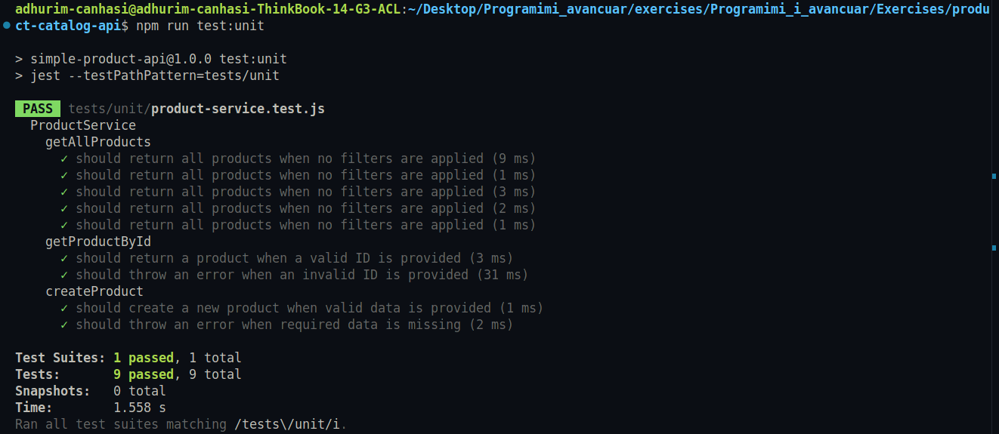
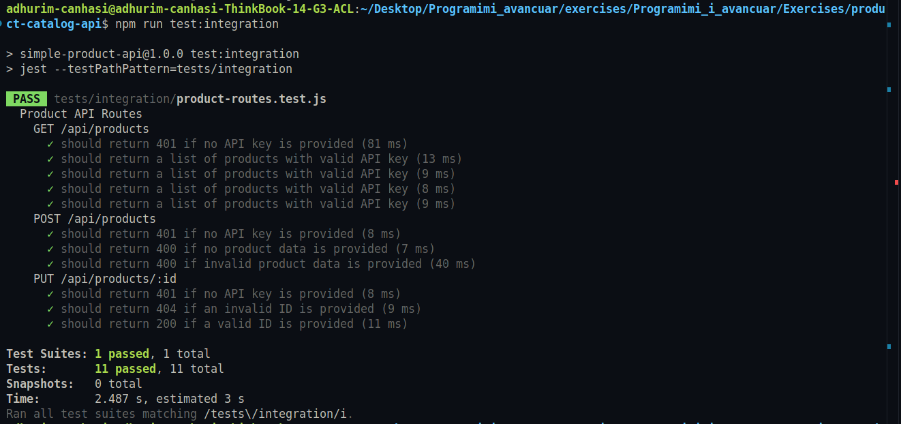

# Learning Journal - March 24, 2025

Today, I delved into API testing, focusing on ensuring the functionality, reliability, and correctness of my API. This experience highlighted the importance of a structured testing strategy and the benefits of using AI tools to assist in the process.

## API Testing Documentation

### 1. Testing Strategy

The goal of this testing process was to ensure the API's functionality, reliability, and correctness. The tests covered:

- **Unit Tests**: For individual functions.
- **Integration Tests**: To verify how different parts of the API interact.
- **Edge Case Handling**: Including invalid inputs and error responses.

### 2. AI-Assisted Testing Process

**AI Tools Used**: I utilized GitHub Copilot to assist with writing test cases.

#### Example Prompts That Worked Well

- **Unit Tests**:

  - "Generate unit tests for the `getAllProducts` method in the `ProductService` class. Include tests for filtering by category, price range, and in-stock status."

  

- **Integration Tests**:

  - "Write integration tests for the `POST /api/products` endpoint that creates a new product. Include tests for successful creation and various validation error cases."

  

- **Edge Cases**:

  - "Help me improve test coverage for the `updateProduct` method. I need to test edge cases like updating a non-existent product and providing invalid updates."

### 3. Test Coverage Analysis

I ran the command:

```sh
npm run test:coverage
```

The test coverage results were:

- **Statements**: 100%
- **Branches**: 100%
- **Functions**: 100%
- **Lines**: 100%


### 4. Challenges and Solutions

- **Challenge 1**: AI-Generated Tests Were Generic

  - **Issue**: Some tests generated by GitHub Copilot were too basic and didn’t cover complex scenarios.
  - **Solution**: I modified the test cases by adding more assertions, testing edge cases, and validating error handling.

- **Challenge 2**: Handling Dynamic Data

  - **Issue**: Some tests failed because the API response contained dynamic values (e.g., timestamps, IDs).
  - **Solution**: Used mocks and stubs to control dynamic data and ensure consistent test results.

- **Challenge 3**: Missing Assertions
  - **Issue**: Some AI-generated tests lacked proper assertions, leading to incomplete validation.
  - **Solution**: Reviewed and added necessary assertions to verify expected outputs properly.

### 5. Learnings

- AI tools like GitHub Copilot can speed up test writing, but human review is necessary to improve accuracy.
- It’s essential to refine prompts for better AI-generated results.
- Running coverage reports helps identify untested code and improve overall test quality.
- Combining AI-generated tests with manual test improvements leads to a more robust test suite.
