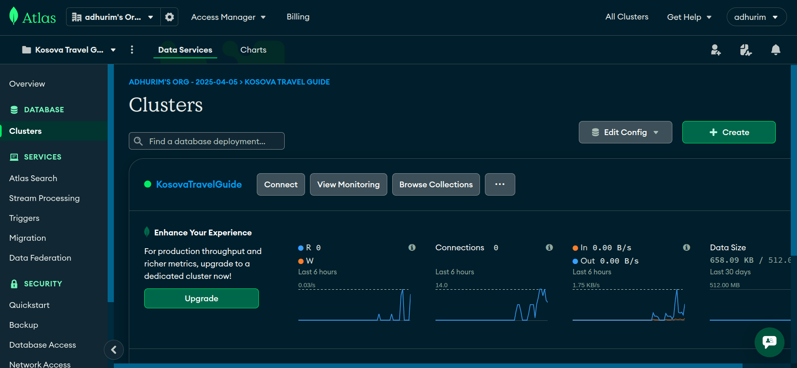

# Learning Journal - April 5, 2025

This week, I took two important steps in our **Kosova Travel Guide** project for the Lab Course: initializing **MongoDB Atlas** and creating the **Navbar component**. I also completed my **3rd mini-project** for the Advanced Programming subject, which involved building a full user profile microservice with authentication using Node.js and Express.

## Project Setup – MongoDB Atlas Connection

After creating a MongoDB Atlas account, I:

- Created a new cluster for our Kosova Travel Guide project.
- Generated the connection string and stored it safely in the `.env` file.
- Connected the database to our backend, laying the foundation for all data-related features (e.g., user reviews, bookmarks, admin content).

This setup made it easier to manage credentials securely and prepares us for scalable data storage as we grow the project.

> 

## UI Foundation – Navbar Component

That same week, I created the first major frontend piece: the **Navbar**. This became more than just a UI element. It helped define the structure and visual style of our whole site.

- We discussed and finalized a **theme** based on the colors and layout of the navbar.
- This helped streamline design decisions later and gave our group (Vjollca, Arjeta, Blinera, and me) a shared visual direction.
- It also allowed us to plan routing more clearly (Home, Cities, Natural Attractions, Login/Profile, etc.).

## Mini-Project 3 – User Profile Microservice

For Advanced Programming, I wrapped up a separate assignment: building a **REST API** for user registration and profile management. It included:

- ✅ User registration with validation
- ✅ JWT-based authentication
- ✅ Protected routes
- ✅ Clean folder structure (MVC)
- ✅ Environment variable usage

### 🔍 Notable Problems and Fixes

- **Bcrypt import error**: Forgot to import it — caused a 500 error on login.  
  Fixed by adding: `const bcrypt = require('bcryptjs');`

- **Password comparison failed**:  
  The hashes were generated with inconsistent salt rounds. I fixed this by standardizing all password hashes using `bcrypt.hashSync(password, 10);`.

- **JWT errors on server restart**:  
  Tokens broke after each restart due to hardcoded secret keys. Fixed by moving secrets to `.env`.

- **403 error in Postman**:  
  Forgot to use the correct Authorization header. Fixed by switching to:  
  `Authorization: Bearer <token>`

### 🧪 Testing Summary

| Endpoint         | Purpose                | Status  |
| ---------------- | ---------------------- | ------- |
| POST /users      | Register user          | ✅      |
| POST /auth/login | Login with credentials | ✅      |
| GET /users/me    | Fetch user profile     | ❌ → ✅ |
| PUT /users/{id}  | Update user data       | ✅      |

## Key Learnings

1. **Setting up a secure backend early saves time** later when scaling or adding users.
2. **Component-first design helps shape the frontend** more than expected.
3. **Using environment variables properly avoids token and secret-related bugs.**
4. **Debugging needs patience and logs** — every undefined or mismatched value has a cause.
5. **Group collaboration works better when technical and visual foundations are clear.**

This was a productive and rewarding week. Both our group project and individual assignment moved forward in solid ways.
