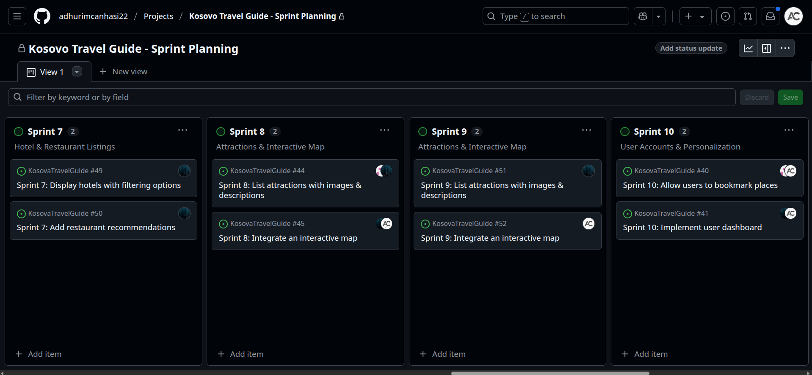

## 📅 Week 5 Journal – May 3

This week I focused on my main role as **SCRUM Master** for the **Kosovo Travel Guide** project.

- ✅ I created a full **weekly sprint plan**, with one sprint per week.
- 🧩 For each sprint, I defined:

  - Tasks we needed to finish
  - Team member assignments

- 🗂️ I also wrote the **User Stories** for the project.
- 🛠️ Tools used:
  - **GitHub Projects** for managing sprints and task assignments
  - **GitHub Issues & Actions** for tracking and linking the user stories

### 📝 Example User Stories

- As a **user**, I want to **bookmark favorite destinations**, so I can view them later easily.
- As an **admin**, I want to **add new places**, so the platform always stays updated.
- As a **user**, I want to **leave reviews** on places I’ve visited, so I can share my experience.
- As a **visitor**, I want to **see detailed information and images** of cities and natural attractions.

### 📸 Screenshot

```md

```
