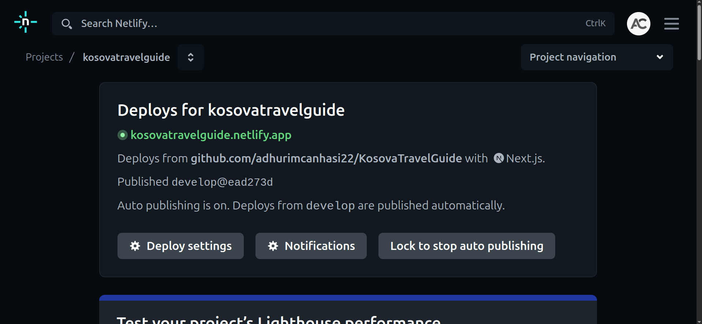

## 📅 Week 6 Journal – May 10

This week I focused on **deploying** our **Kosovo Travel Guide** project.

### 🚀 Deployments

- 🔧 I set up **two separate Netlify deploys**:

  - 🧪 Testing: [kosovatravelguidetest.netlify.app](https://kosovatravelguidetest.netlify.app)
  - 🌐 Main: [kosovatravelguide.netlify.app](https://kosovatravelguide.netlify.app)

- ✅ These allowed me to test new features before pushing to the main live site.
- 🔄 Commits triggered automatic builds on both deployments.

### 🐛 Deployment Issue: Tailwind Not Found

- ❌ Netlify builds were **failing** with a Tailwind-related error.
- 🧩 After deep debugging, I found the issue:

  - **NODE_ENV was set to `production`**
  - Tailwind was listed under `devDependencies`, so it wasn’t being included in production builds.

- 🛠️ Solution: I moved Tailwind (and related packages) to the `dependencies` section in `package.json`.

```json
"dependencies": {
  "tailwindcss": "^3.3.2",
  "autoprefixer": "^10.4.14",
  "postcss": "^8.4.21"
}
```

## ✅ After that, the build succeeded and the sites went live.

## 🔐 Backend Work

- Worked on JWT session handling for user login.

- Started implementing admin-specific features, including:

  - Adding accommodations

  - Adding travel destinations

## 📸 Screenshot




