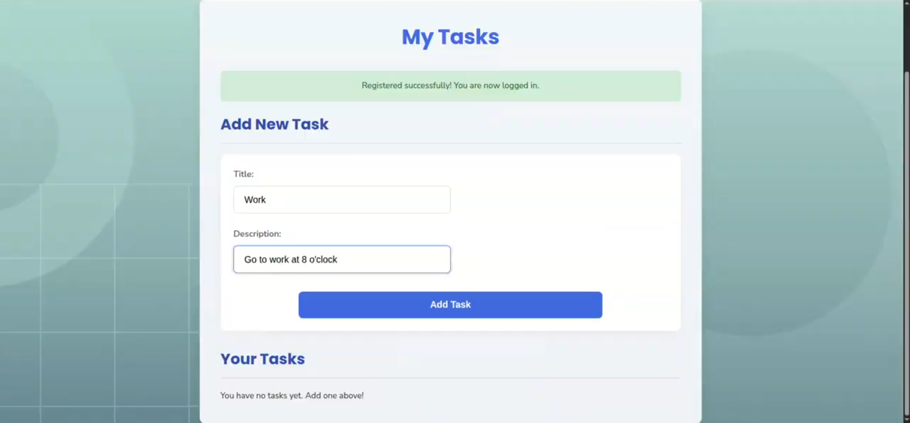

## 📅 Week 7 Journal – May 17

This week was very busy with **project work** from both **Web Programming** and **Advanced Programming** classes, while still handling progress in the **Kosovo Travel Guide** project.

---

### 💻 Web Programming – MERN Task Manager

- We were asked to create a **full MERN stack** app.
- I chose the **Task Manager** app idea.
- Features included:
  - 🧾 User registration and login
  - ✅ View tasks
  - ➕ Create tasks
  - ✏️ Edit tasks
  - 🗑️ Delete tasks
- The whole app was built using:
  - MongoDB (database)
  - Node.js + Express.js (backend)
  - React (frontend)

## 💅 Advanced Programming – Bella Beauty Appointments

For this project, me and **Vjollca** picked a beauty salon app idea.

We named it **Bella Beauty**.

Users will be able to:

- Browse services
- Book appointments
- See appointment status

We had full freedom in choosing the tech stack, but:

- It had to be **dockerized**
- Each **microservice** had to run independently on its own port

---

## 🌍 Kosovo Travel Guide – Continued Backend Work

I continued working on the backend to:

- Fetch destination/accommodation data from **MongoDB**
- Format it for **frontend display**
- Make it easier for users to **explore and interact** with

Even though managing multiple projects was tiring, it helped me improve a lot in both **planning** and **coding**.
