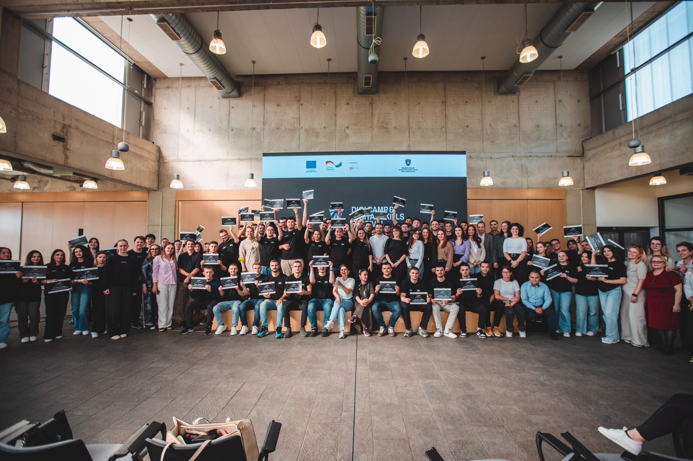

## 🏆 Hackathon Experience – JunctionX & ITP Prizren

From **May 21st to May 23rd**, I joined a **hackathon** with my teammates **Redon** and **Behar**, organized by **JunctionX** and **ITP Prizren**.

We picked one of the proposed ideas:  
**AI & Blockchain for Pension and Death Registration**.

Our solution:

- **Digitalized both pension and death registration**
- Integrated the idea into **eKosova**, the existing government portal
- Used **facial recognition AI** for pension verification
- Used **blockchain** for secure hospital confirmations of death
- Required only minimal input: personal IDs and names for the deceased, spouse, and informer
- Automated verification through existing systems

This tackled both **AI** and **Cybersecurity**, fitting both competition categories.

Out of **23 teams**, we made it to the **Top 6 finalists** and pitched our idea in front of the jury.

We were **ranked 3rd**.  
The winning teams earned a spot at the next hackathon in **Helsinki, Finland**, but this time, we fell just short.

Still, it was a great achievement:

- We had fun
- We learned a lot
- We built a great project
- We received **certificates of participation**

